# FilmFarsi 

<!-- badges: start -->
#### Celebration of Pre-revolutionary Iranian Cinema
<!-- badges: end -->

[](https://github.com/FarhadPishgar/FilmFarsi)

## Introduction

The term FilmFarsi was first used by the film critic [Houshang Kavoosi](https://fa.wikipedia.org/wiki/هوشنگ_کاووسی) to refer to the popular cinema before the Iranian revolution, in which movies were characterized by ‘song and dance, sex and seduction, violence and vengeance’ blended with Iranian ‘local flavor.’

The `FilmFarsi` package provides color palettes inspired by posters of pre-revolutionary Iranian movies.

## Installation

The latest version of the `FilmFarsi` package can be installed from GitHub as follows:

``` r
devtools::install_github(repo = "FarhadPishgar/FilmFarsi")
```

## Palettes

The `FilmFarsi` package includes more than 10 different color palettes to choose from.

### Gav 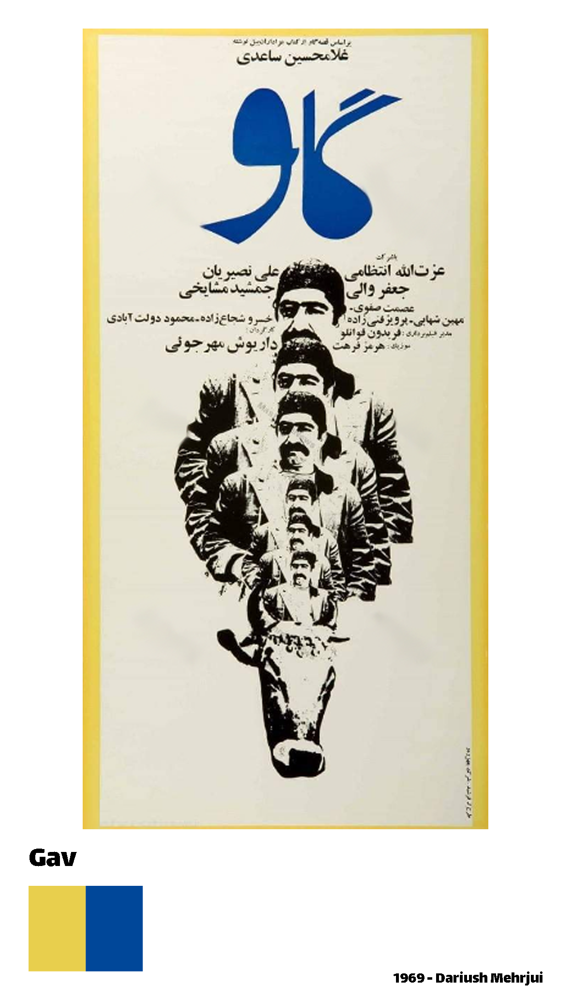

<br><br><br><br><br>

IMDb Rating: 7.9/10

Year: 1969

Director: Dariush Mehrjui

Writer: Dariush Mehrjui

Star: Ezzatolah Entezami

Palette: `gav`


<br>

Example:

``` r
library(ggplot2)
library(MatchThem)
library(FilmFarsi)

ggplot(osteoarthritis, aes(x = SEX, y = AGE, fill = SEX)) + 
  geom_boxplot() +
  theme_classic() +
  theme(legend.position = "none") +
  scale_x_discrete(labels = c("1" = "Female", "2" = "Male")) +
  labs(title = "Age of participants",x = "Sex", y = "Age (year)") +
  scale_fill_manual(values = FilmFarsi("gav"))


```

### Marsieh 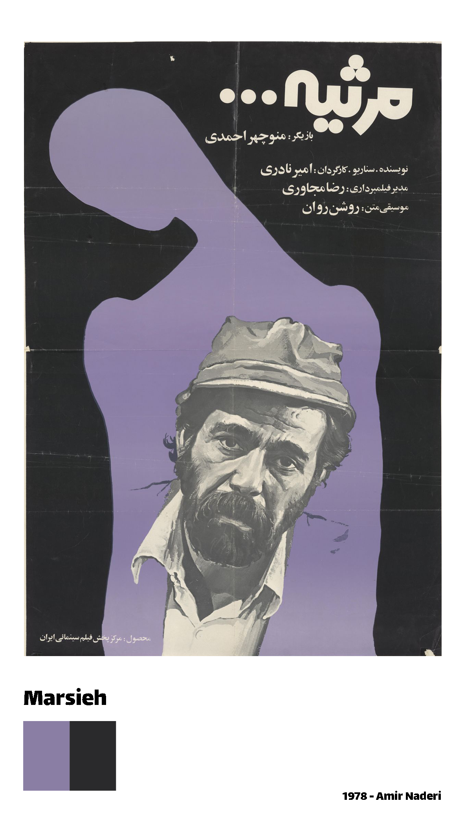

<br><br><br><br><br>

IMDb Rating: 7.4/10

Year: 1978

Director: Amir Naderi

Writer: Amir Naderi

Star: Manoucher Ahmadi

Palette: `marsieh`


<br>

Example:

``` r
library(ggplot2)
library(MatchThem)
library(FilmFarsi)

ggplot(osteoarthritis, aes(x = SEX, y = AGE, fill = SEX)) + 
  geom_boxplot() +
  theme_classic() +
  theme(legend.position = "none") +
  scale_x_discrete(labels = c("1" = "Female", "2" = "Male")) +
  labs(title = "Age of participants",x = "Sex", y = "Age (year)") +
  scale_fill_manual(values = FilmFarsi("marsieh"))


```

### Gavaznha 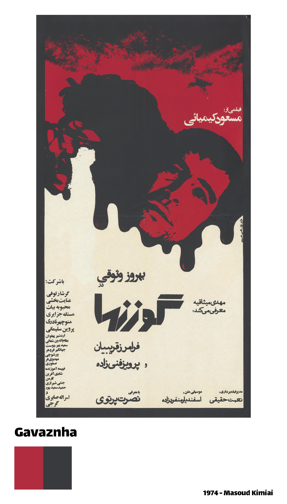

<br><br><br><br><br>

IMDb Rating: 7.9/10

Year: 1974

Director: Masud Kimiai

Writer: Masud Kimiai

Star: Behrouz Vossoughi

Palette: `gavaznha`


<br>

Example:

``` r
library(ggplot2)
library(MatchThem)
library(FilmFarsi)

ggplot(osteoarthritis, aes(x = SEX, y = AGE, fill = SEX)) + 
  geom_boxplot() +
  theme_classic() +
  theme(legend.position = "none") +
  scale_x_discrete(labels = c("1" = "Female", "2" = "Male")) +
  labs(title = "Age of participants",x = "Sex", y = "Age (year)") +
  scale_fill_manual(values = FilmFarsi("gavaznha"))


```

### Reza Motori 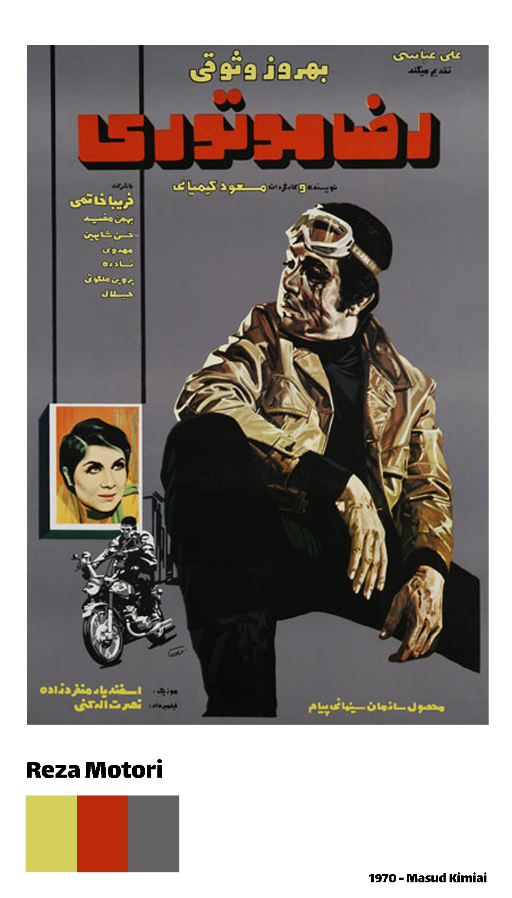

<br><br><br><br><br>

IMDb Rating: 6.6/10

Year: 1970

Director: Masud Kimiai

Writer: Masud Kimiai

Star: Behrouz Vossoughi

Palette: `reza`


<br>

Example:

``` r
library(ggplot2)
library(FilmFarsi)
data("ToothGrowth")

ggplot(ToothGrowth, aes(x = factor(dose), y = len, fill = factor(dose))) + 
  geom_boxplot() +
  theme_classic() +
  theme(legend.position = "none") +
  scale_x_discrete(labels = c("0.5" = "0.5 mg/day", "1" = "1 mg/day", "2" = "2 mg/day")) +
  labs(title = "Tooth growth in Guinea pigs", x = "Dose levels of vitamin C", y = "Tooth growth") +
  scale_fill_manual(values = FilmFarsi("reza"))


```

### Raghaseye Shahr 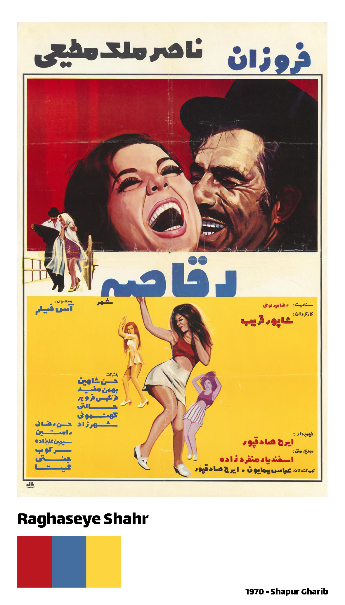

<br><br><br><br><br>

IMDb Rating: 7.9/10

Year: 1970

Director: Shapur Gharib

Writer: Reza Mirlohi

Star: Fourouzan

Palette: `raghaseh`


<br>

Example:

``` r
ggplot(ToothGrowth, aes(x = factor(dose), y = len, fill = factor(dose))) + 
  geom_boxplot() +
  theme_classic() +
  theme(legend.position = "none") +
  scale_x_discrete(labels = c("0.5" = "0.5 mg/day", "1" = "1 mg/day", "2" = "2 mg/day")) +
  labs(title = "Tooth growth in Guinea pigs", x = "Dose levels of vitamin C", y = "Tooth growth") +
  scale_fill_manual(values = FilmFarsi("raghaseh"))
  
  
  
  
```

### Yeki Khosh Seda, Yeki Khosh Dast 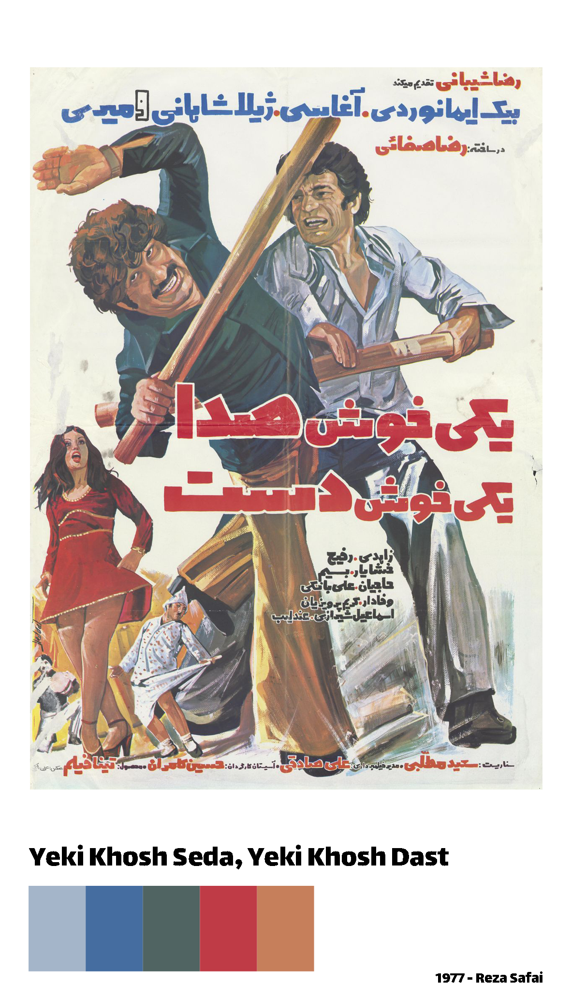

<br><br><br><br><br>

IMDb Rating: 5.2/10

Year: 1977

Director: Reza Safai

Writer: Saeed Motalebi

Star: Reza Beyk Imanverdi

Palette: `yeki`


<br>

Example:

``` r
library(ggplot2)
library(FilmFarsi)


```

### Soltane Ghalbha 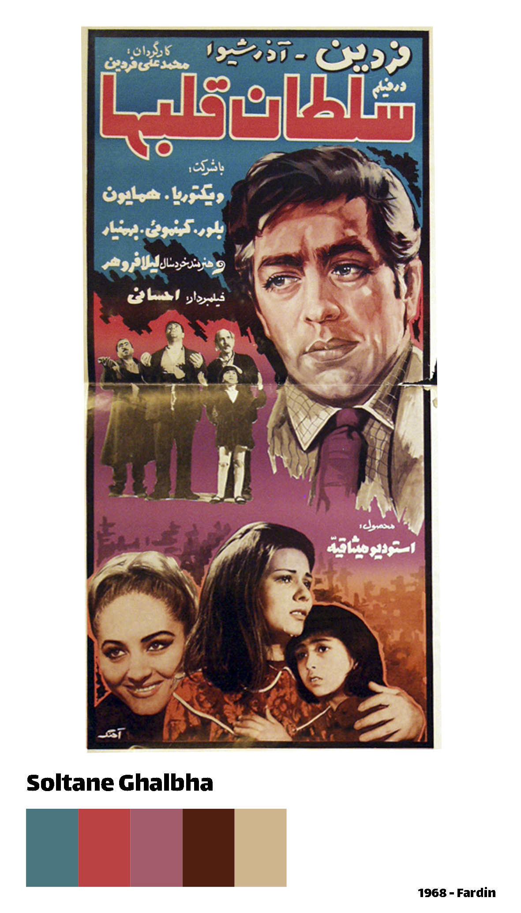

<br><br><br><br><br>

IMDb Rating: 7.0/10

Year: 1968

Director: Fardin

Writer: Fardin

Star: Fardin

Palette: `soltane-ghalbha`

Palette: `soltan`

<br>

Example:

``` r
library(ggplot2)
library(FilmFarsi)


```

### Salome 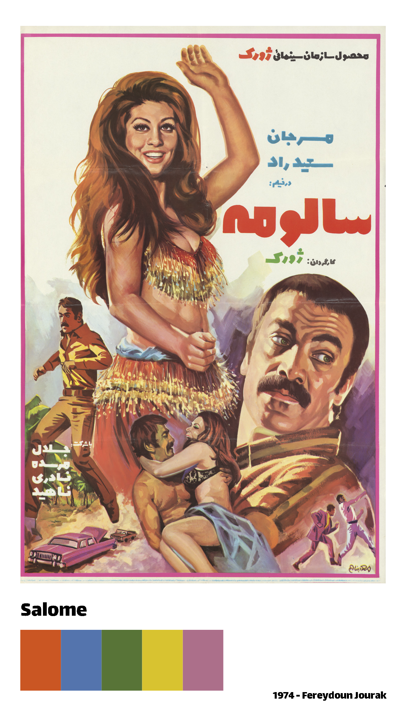

<br><br><br><br><br>

IMDb Rating: 3.9/10

Year: 1974

Director: Fereydoun Jourak

Writer: Sirus Alvand

Star: Marjan

Palette: `salome`

<br><br>

Example:

``` r
library(ggplot2)
library(FilmFarsi)


```

### Kandu 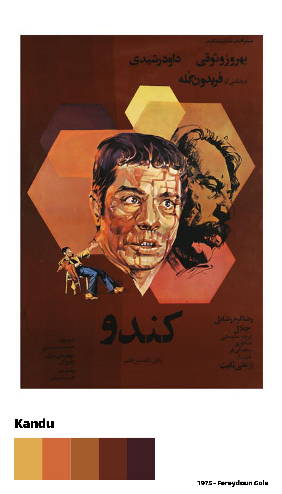

<br><br><br><br><br>

IMDb Rating: 7.4/10

Year: 1975

Director: Fereydoun Gole

Writer: Fereydoun Gole

Star: Behrouz Vossoughi

Palette: `kandu`

Palette: `beehive`

<br>

Example:

``` r
library(ggplot2)
library(FilmFarsi)


```

### Morghe Tokhm Tala 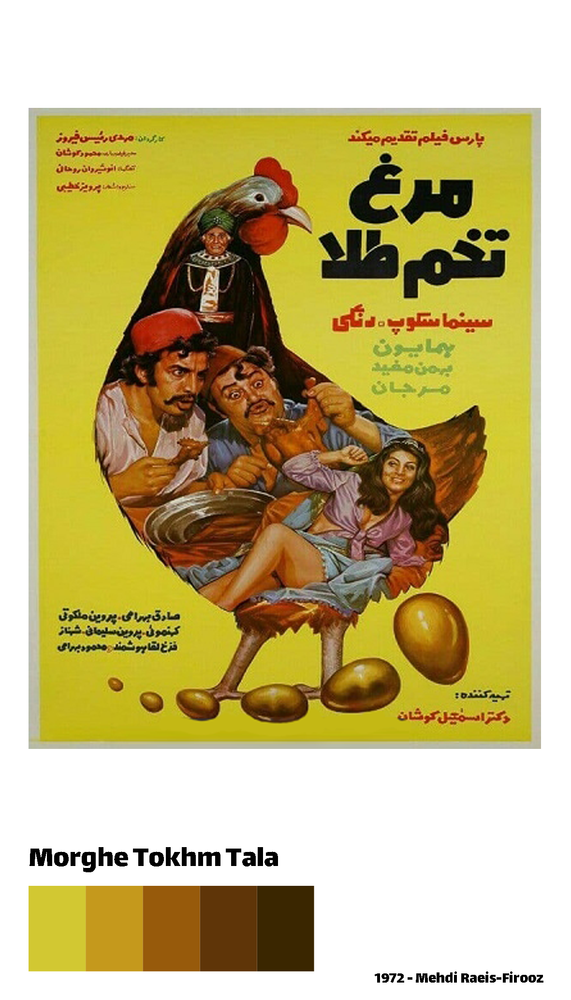

<br><br><br><br><br>

IMDb Rating: 5.7/10

Year: 1972

Director: Mehdi Raeis-Firooz

Writer: Parviz Khatibi

Star: Homayoon

Palette: `morghe-tokhm-tala`

Palette: `morgh`

<br>

Example:

``` r
library(ggplot2)
library(FilmFarsi)


```

### Navvab 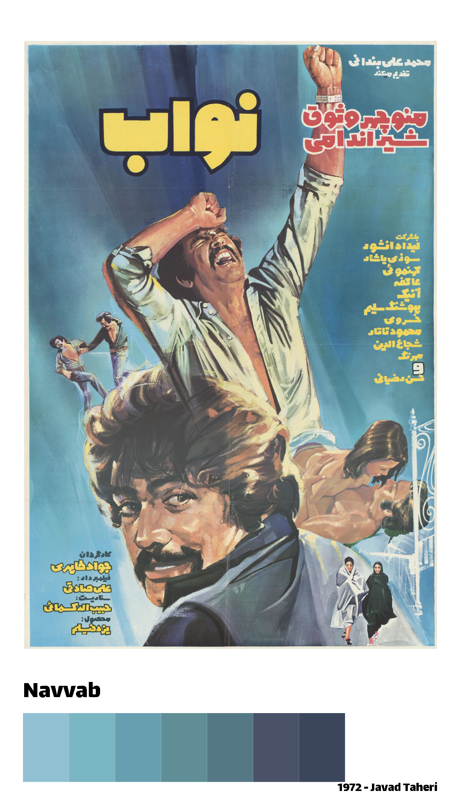

<br><br><br><br><br>

IMDb Rating: -

Year: 1972

Director: Javad Taheri

Writer: Habibollah Kasmai

Star: Manoochehr Vossoogh

Palette: `navvab`

<br><br>

Example:

``` r
library(ggplot2)
library(FilmFarsi)


```

### Khashme Oghabha 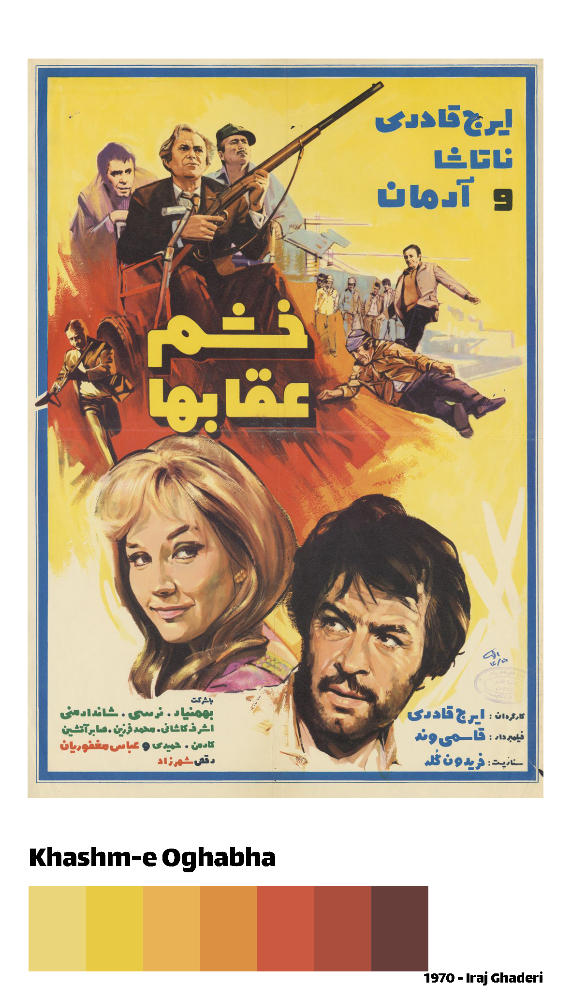

<br><br><br><br><br>

IMDb Rating: 3.6/10

Year: 1970

Director: Iraj Ghaderi

Writer: Fereydoun Gole

Star: Iraj Ghaderi

Palette: `khashme-oghabha`

Palette: `khashm`

<br>

Example:

``` r
library(ggplot2)
library(FilmFarsi)


```

## Acknowledgments
The

## Author
Farhad Pishgar

[](https://twitter.com/FarhadPishgar)
