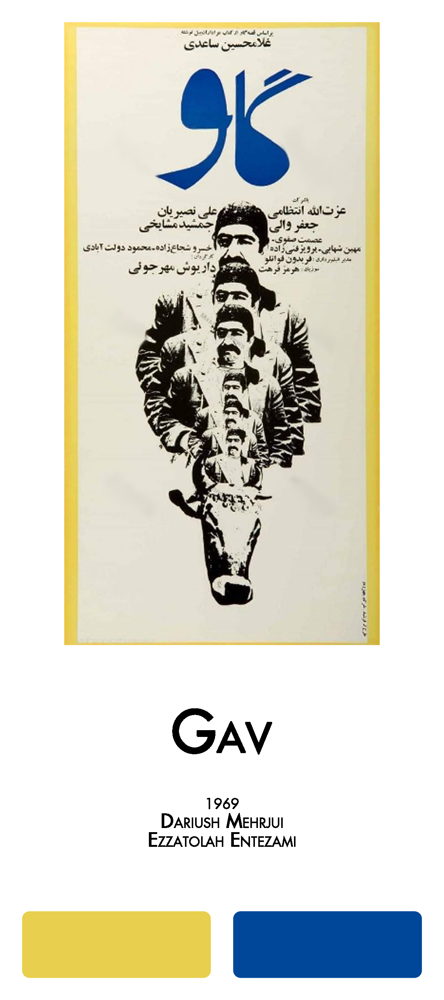
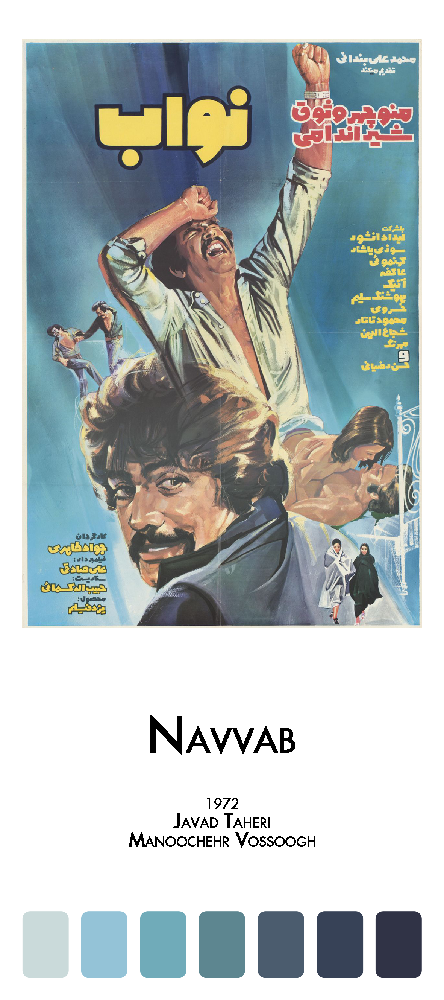

# FilmFarsi 

<!-- badges: start -->
#### Celebration of Pre-revolutionary Iranian Cinema
<!-- badges: end -->

[](https://github.com/FarhadPishgar/FilmFarsi)

## Introduction

The term FilmFarsi (فیلمفارسی in Persian) was first used by the film critic [Houshang Kavoosi](https://fa.wikipedia.org/wiki/هوشنگ_کاووسی) to refer to the popular cinema before the Iranian revolution, in which movies were characterized by ‘song and dance, sex and seduction, violence and vengeance’ blended with Iranian ‘local flavor.’

The `FilmFarsi` package presents color palettes inspired by posters of some of pre-revolutionary Iranian movies.

## Installation

The latest version of the `FilmFarsi` package can be installed from GitHub as follows:

``` r
devtools::install_github(repo = "FarhadPishgar/FilmFarsi")
```

## Palettes

The `FilmFarsi` package includes more than 25 different color palettes to choose from.

### The Cow 

<br><br><br><br><br>

IMDb Rating: 7.9/10

Year: 1969

Director: Dariush Mehrjui

Writer: Dariush Mehrjui

Star: Ezzatolah Entezami

Palette: `gav`

Palette: `cow`

<br>

Example:

``` r
library(ggplot2)
library(FilmFarsi)


```

### Marsieh 

<br><br><br><br><br>

IMDb Rating: 7.4/10

Year: 1978

Director: Amir Naderi

Writer: Amir Naderi

Star: Manoucher Ahmadi

Palette: `marsieh`

Palette: `requiem`

<br>

Example:

``` r
library(ggplot2)
library(FilmFarsi)


```

### Gavaznha 

<br><br><br><br><br>

IMDb Rating: 7.9/10

Year: 1974

Director: Masud Kimiai

Writer: Masud Kimiai

Star: Behrouz Vossoughi

Palette: `gavaznha`

Palette: `deer`

<br>

Example:

``` r
library(ggplot2)
library(FilmFarsi)


```

### Raghaseye Shahr 

<br><br><br><br><br>

IMDb Rating: 7.9/10

Year: 1970

Director: Shapur Gharib

Writer: Reza Mirlohi

Star: Fourouzan

Palette: `raghaseye-shahr`

Palette: `raghaseye`

<br>

Example:

``` r
library(ggplot2)
library(FilmFarsi)


```


### Yeki Khosh Seda, Yeki Khosh Dast 

<br><br><br><br><br>

IMDb Rating: 5.2/10

Year: 1977

Director: Reza Safai

Writer: Saeed Motalebi

Star: Reza Beyk Imanverdi

Palette: `yeki-khosh-seda-yeki-khosh-dast`

Palette: `yeki`

<br>

Example:

``` r
library(ggplot2)
library(FilmFarsi)


```

### Salome 

<br><br><br><br><br>

IMDb Rating: 3.9/10

Year: 1974

Director: Fereydoun Jourak

Writer: Sirus Alvand

Star: Marjan

Palette: `salome`

<br><br>

Example:

``` r
library(ggplot2)
library(FilmFarsi)


```

### Kandu 

<br><br><br><br><br>

IMDb Rating: 7.4/10

Year: 1975

Director: Fereydoun Gole

Writer: Fereydoun Gole

Star: Behrouz Vossoughi

Palette: `kandu`

Palette: `beehive`

<br>

Example:

``` r
library(ggplot2)
library(FilmFarsi)


```

### Navvab 

<br><br><br><br><br>

IMDb Rating: ?/10

Year: 1972

Director: Javad Taheri

Writer: Habibollah Kasmai

Star: Manoochehr Vossoogh

Palette: `navvab`

<br><br>

Example:

``` r
library(ggplot2)
library(FilmFarsi)


```

### Khashm-e Oghabha 

<br><br><br><br><br>

IMDb Rating: 3.6/10

Year: 1970

Director: Iraj Ghaderi

Writer: Fereydoun Gole

Star: Iraj Ghaderi

Palette: `khashm-e-oghabha`

Palette: `khashm`

<br>

Example:

``` r
library(ggplot2)
library(FilmFarsi)


```

## Acknowledgments
The

## Author
Farhad Pishgar

[](https://twitter.com/FarhadPishgar)
