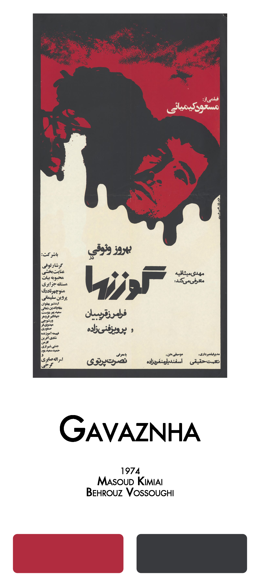

# FilmFarsi 

<!-- badges: start -->
#### Celebration of Pre-revolutionary Iranian Cinema
<!-- badges: end -->

[](https://github.com/FarhadPishgar/FilmFarsi)

## Introduction

The term FilmFarsi (or فیلمفارسی in Persian) was first used by the film critic Hushang Kavusi to refer to the popular cinema before the 1979 Iranian revolution, in which movies were characterized by ‘song and dance, sex and seduction, violence and vengeance’ blended with Iranian ‘local flavour’ .
The `FilmFarsi` package

## Installation

The latest (though unstable) version of the `FilmFarsi` package can be installed from GitHub as follows:

``` r
devtools::install_github(repo = "FarhadPishgar/FilmFarsi")
```

## Palettes

Adopting

### Gavaznha 

<br><br><br><br><br>

IMDb Rating: 7.9/10

Year: 1974

Director: Masud Kimiai

Writer: Masud Kimiai

Stars: Behrouz Vossoughi, Faramarz Gharibian, and Nosrat Partovi

Palette: `gavaznha`

Palette: `deer`

<br>

Example:

``` r
library(ggplot2)
library(FilmFarsi)


```

### Yeki Khosh Seda, Yeki Khosh Dast 

<br><br><br><br><br>

IMDb Rating: 5.2/10

Year: 1977

Director: Reza Safai

Writer: Saeed Motalebi

Stars: Reza Beyk Imanverdi, Nematollah Aghasi, and Zhila Shahani

Palette: `yeki-khosh-seda-yeki-khosh-dast`

Palette: `yeki`

<br>

Example:

``` r
library(ggplot2)
library(FilmFarsi)


```


## Acknowledgments
The

## Author
Farhad Pishgar

[](https://twitter.com/FarhadPishgar)
