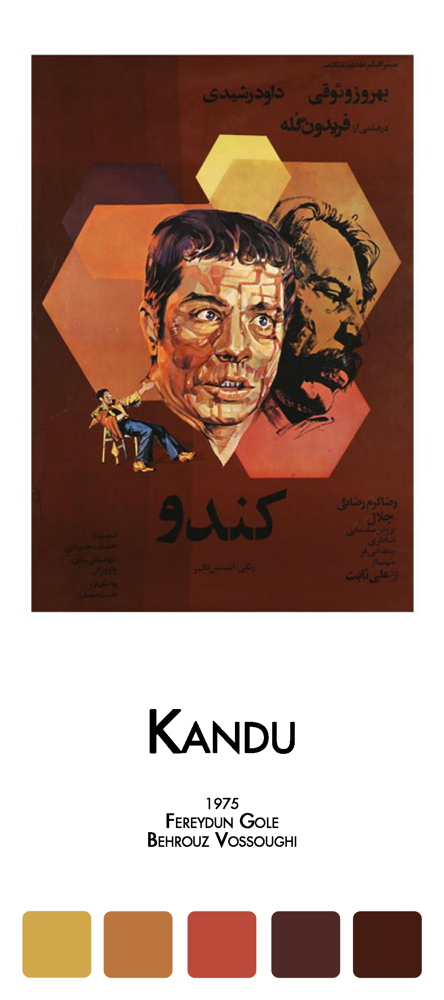
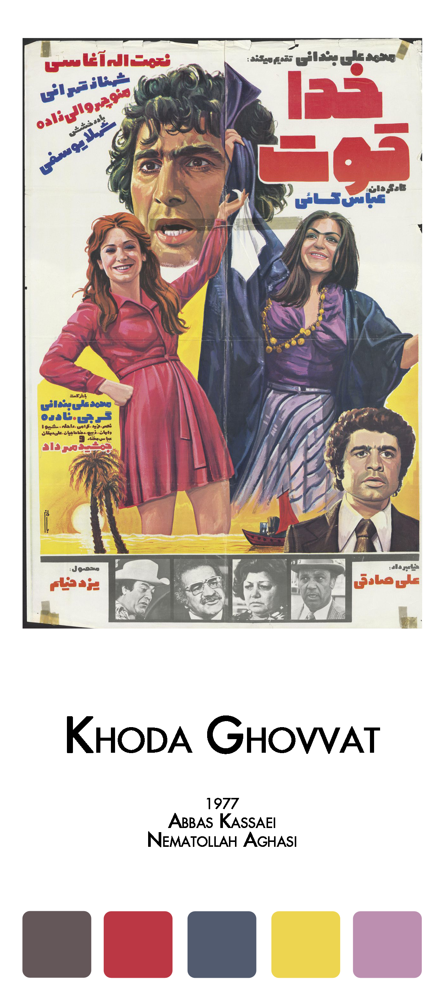
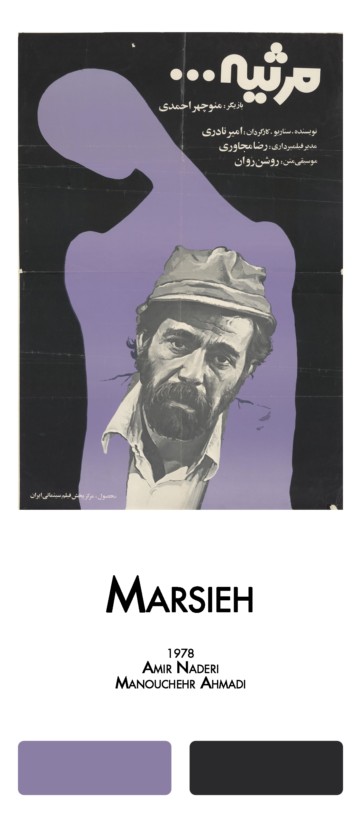

# FilmFarsi 

<!-- badges: start -->
#### Celebration of Pre-revolutionary Iranian Cinema
<!-- badges: end -->

[](https://github.com/FarhadPishgar/FilmFarsi)

## Introduction

The term FilmFarsi was first used by the film critic [Houshang Kavoosi](https://fa.wikipedia.org/wiki/هوشنگ_کاووسی) to refer to the popular cinema before the Iranian revolution, in which movies were characterized by ‘song and dance, sex and seduction, violence and vengeance’ blended with Iranian ‘local flavor.’ `FilmFarsi` package provides color palettes inspired by posters of pre-revolutionary Iranian movies.

## Installation

The latest version of the `FilmFarsi` package can be installed from GitHub as follows:

``` r
devtools::install_github(repo = "FarhadPishgar/FilmFarsi")
```

## Palettes

The `FilmFarsi` package includes around 30 different color palettes to choose from.

<p align="center">










  
</p>

## Acknowledgments
The majority of images included in this package are sourced from the Iranian and Middle Eastern Movie Posters Collection, curated by [Hamid Naficy](https://communication.northwestern.edu/faculty/hamid-naficy.html) and housed in the University Archives of Northwestern University Libraries. These images are intended solely for use by students, faculty, staff, and other researchers for scholarly and research consultation purposes. Any commercial use or further distribution of the images is strictly prohibited.

## Author
Farhad Pishgar

[](https://twitter.com/FarhadPishgar)
